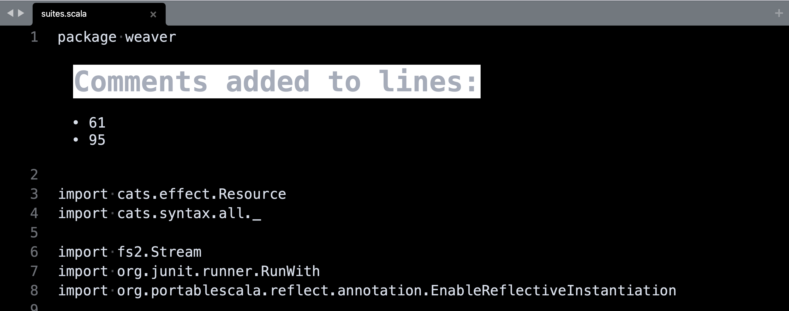
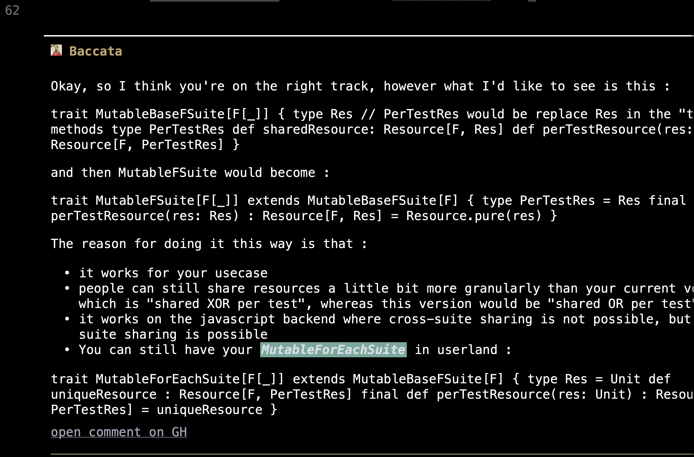

# Ghomments

Ghomments renders `.comment` files generated by [purs](https://github.com/ssanj/purs) in Sublime Text.

## Installation

- Open the command palette with `CMD + SHIT + P`
- Select `Package Control: Add Repository`
- Enter https://github.com/ssanj/ghomments for the repository
- Select `Package Control: Install Package`
- Choose Ghomments

## Usage

After checking our a pull request with purs, if you want to overlay the comments for a given file, run `Ghomments Render` from the command palette.

For example, if you checked out file XYZ.rs and there's an XYZ.rs.comment file in the same directory, open up the XYZ.rs file and run `Ghomments Render`.

Ghomments will insert a header at the top of the file with the location of the comments.

You can use the key combo: `CMD + SHIFT + C` to jump to the next comment

The `open comment on GH` will take you directly to the comment on the GitHub pull request.
